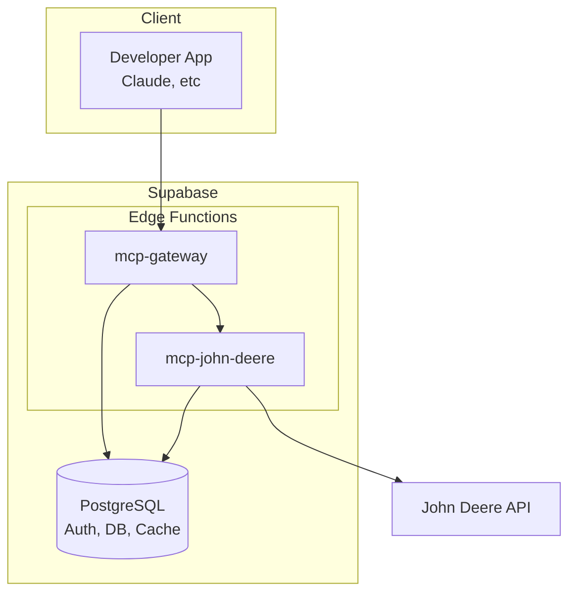

# FieldMCP

> **⛔ CRITICAL: NEVER USE `cd` IN BASH COMMANDS ⛔**
>
> You are already in the working directory. Run commands directly.
>
> ❌ WRONG: `cd apps/dashboard && pnpm add package`
>
> ✅ RIGHT: `pnpm --filter dashboard add package`
>
> ❌ WRONG: `cd packages/supabase && pnpm test`
>
> ✅ RIGHT: `pnpm --filter @fieldmcp/supabase test`
>
> This is a pnpm monorepo. Use `--filter <package-name>` to target workspaces.

> **⛔ CRITICAL: NEVER REDIRECT OUTPUT TO NULL IN BASH ⛔**
>
> This is Windows. Redirecting to `/dev/null` or `nul` creates a file called `nul`.
>
> ❌ WRONG: `command > /dev/null 2>&1`
>
> ❌ WRONG: `command 2>/dev/null`
>
> ✅ RIGHT: Just let the output appear, or don't use redirections.

MCP infrastructure platform for agricultural APIs. Developers integrate once, access John Deere (and later Climate
FieldView, CNHi) through unified MCP servers.

## Quick Commands

```bash
pnpm build            # Build all packages (turbo)
pnpm dev              # Start dashboard + edge functions in dev mode (hot reload)
pnpm start:local      # Build and run all services locally (production-like)
pnpm lint             # Run Biome linter (check)
pnpm lint:fix         # Run Biome linter with auto-fix
pnpm check            # TypeScript type check (turbo)
pnpm clean            # Clean build artifacts (turbo)
pnpm test:e2e         # Run end-to-end tests
pnpm test:e2e:watch   # Run e2e tests in watch mode
pnpm copy-types       # Copy shared types to Edge Functions
pnpm supabase:start   # Start local Supabase
pnpm supabase:stop    # Stop local Supabase
pnpm supabase:reset   # Reset Supabase database
```

## Architecture



- **Supabase Edge Functions**: MCP servers (mcp-gateway, mcp-john-deere) - Deno runtime
- **Supabase**: Auth, PostgreSQL, encrypted token storage, cache tables
- **Vercel**: Next.js 16 dashboard (apps/dashboard)
- **Turborepo**: Monorepo orchestration

## Key Directories

```
fieldmcp/
├── apps/
│   └── dashboard/                        # Next.js 16 developer dashboard
│       └── src/
│           ├── app/
│           │   ├── (auth)/               # Auth pages (login, signup)
│           │   ├── actions/              # Server actions
│           │   ├── api/                  # API routes
│           │   │   ├── auth/             # Auth endpoints
│           │   │   ├── billing/          # Stripe checkout/portal
│           │   │   ├── connections/      # Farmer connection management
│           │   │   ├── keys/             # API key management
│           │   │   ├── oauth/john-deere/ # John Deere OAuth flow
│           │   │   └── webhooks/stripe/  # Stripe webhooks
│           │   └── dashboard/            # Dashboard pages (billing, connections, keys)
│           ├── components/               # React components (auth, dashboard, layout, seo, skeletons)
│           ├── hooks/                    # Custom React hooks
│           └── lib/                      # Utilities (data fetching, supabase client)
├── packages/
│   ├── types/                            # Shared TypeScript types (@fieldmcp/types)
│   ├── ui/                               # Shared UI components (@fieldmcp/ui)
│   │   └── src/
│   │       ├── components/               # Reusable UI components
│   │       ├── hooks/                    # Shared hooks
│   │       ├── lib/                      # UI utilities
│   │       └── styles/                   # Shared styles
│   └── supabase/                         # Supabase package (@fieldmcp/supabase)
│       └── supabase/
│           ├── functions/
│           │   ├── _shared/              # Shared Edge Function code
│           │   │   ├── core/             # Core functionality
│           │   │   │   ├── auth/         # API key validation
│           │   │   │   ├── billing/      # Usage limits, tier checks
│           │   │   │   └── routing/      # Request routing
│           │   │   ├── providers/deere/  # John Deere API client
│           │   │   └── types/            # Shared types for Edge Functions
│           │   ├── mcp-gateway/          # API gateway - auth, rate limits, routing
│           │   └── mcp-john-deere/       # John Deere MCP server
│           └── migrations/               # Database migrations
├── scripts/                              # Build/dev scripts
│   └── lib/                              # Script utilities
└── tests/
    └── e2e/                              # End-to-end tests
```

## Standards

- **⛔ NEVER use `cd` in Bash commands** - See critical warning at top of file. Use `pnpm --filter <package>` for workspace commands.
- TypeScript everywhere, strict mode
- Biome for linting/formatting (NOT ESLint/Prettier)
- pnpm workspaces
- Commit after each completed task
- Edge Functions use Deno (npm: specifiers for packages)

## Code Patterns

### API Keys

- Format: `field_live_` + 32 random chars
- Storage: SHA-256 hash in DB, never plaintext
- Validation: Check hash, cache result in Postgres for 5 min

### OAuth Tokens

- Encrypted at rest (base64 for MVP, Supabase Vault for prod)
- Proactive refresh when < 5 min remaining
- Cached in Postgres per developer+farmer+provider

### MCP Tools

```typescript
// Pattern: Zod schema → handler → normalize → return
export const toolSchema = z.object({...});

export async function toolHandler(input, client) {
    const response = await client.apiCall();
    const normalized = normalizeResponse(response);
    return {content: [{type: 'text', text: JSON.stringify(normalized)}]};
}
```

### Rate Limiting

- Sliding window per minute using cache.rate_limits table
- Monthly limits using cache.monthly_usage table with atomic increment
- Limits by tier: Free=60/min, Developer=100/min, Startup=500/min, Enterprise=1000/min

### Cache Tables (replaces Cloudflare KV)

- `cache.rate_limits` - Per-minute and auth failure counters
- `cache.api_key_cache` - Validated API key cache
- `cache.token_cache` - OAuth token cache
- `cache.monthly_usage` - Monthly request counter per developer
- Expired entries cleaned by pg_cron every 5 minutes

## Workflows

### Before modifying MCP server code:

1. Check if change affects shared types in `packages/types`
2. Update types package first if needed
3. Run `pnpm check` before committing

### Before modifying Supabase schema:

1. Create new migration: `pnpm --filter @fieldmcp/supabase db:new migration_name`
2. Test locally: `pnpm --filter @fieldmcp/supabase db:reset`
3. NEVER modify existing migrations

### Before deploying:

1. Run `pnpm build` from root
2. Run `pnpm check` from root
3. Run `pnpm lint` from root

## Environment Variables

### Supabase Edge Functions (packages/supabase/.env.local)

- `SUPABASE_URL` - Auto-set by Supabase
- `SUPABASE_SERVICE_ROLE_KEY` - Auto-set by Supabase
- `JOHN_DEERE_CLIENT_ID`
- `JOHN_DEERE_CLIENT_SECRET`
- `JOHN_DEERE_API_BASE` - `https://sandboxapi.deere.com/platform` or `https://api.deere.com/platform`
- `INTERNAL_SECRET` - Secret for cache invalidation endpoint

### apps/dashboard (.env.local)

- `NEXT_PUBLIC_SUPABASE_URL`
- `NEXT_PUBLIC_SUPABASE_ANON_KEY`
- `SUPABASE_SERVICE_KEY`
- `JOHN_DEERE_CLIENT_ID`
- `JOHN_DEERE_CLIENT_SECRET`
- `JOHN_DEERE_REDIRECT_URI`
- `STRIPE_SECRET_KEY`
- `STRIPE_WEBHOOK_SECRET`
- `NEXT_PUBLIC_GATEWAY_URL` (Supabase URL - functions at /functions/v1/*)
- `GATEWAY_INTERNAL_SECRET` (must match edge function's INTERNAL_SECRET)

## API Reference

### MCP Endpoints

- Gateway: `POST {SUPABASE_URL}/functions/v1/mcp-gateway`
- John Deere: `POST {SUPABASE_URL}/functions/v1/mcp-john-deere` (internal)

### John Deere

- Auth: `https://signin.johndeere.com/oauth2/aus78tnlaysMraFhC1t7/v1/authorize`
- Token: `https://signin.johndeere.com/oauth2/aus78tnlaysMraFhC1t7/v1/token`
- API: `https://sandboxapi.deere.com/platform` (sandbox), `https://api.deere.com/platform` (prod)
- Scopes: `ag1 ag2 ag3 offline_access`
- Header: `Accept: application/vnd.deere.axiom.v3+json`

## Next.js 16 Notes

- **Auth uses `proxy.ts`, NOT `middleware.ts`** - Next.js 16 uses proxy for auth
- Webhook routes must be excluded from auth checks in `src/proxy.ts`

## Troubleshooting

### "Module not found" errors

Run `pnpm install` from root, then `pnpm build`

### Type errors in IDE but build passes

Restart TypeScript server, or run `pnpm check` to verify

### OAuth callback fails

Check redirect URI matches exactly in John Deere dev portal and env vars

### Rate limit errors in dev

Cache state persists in Postgres - wait 1 minute or query/delete from cache.rate_limits
