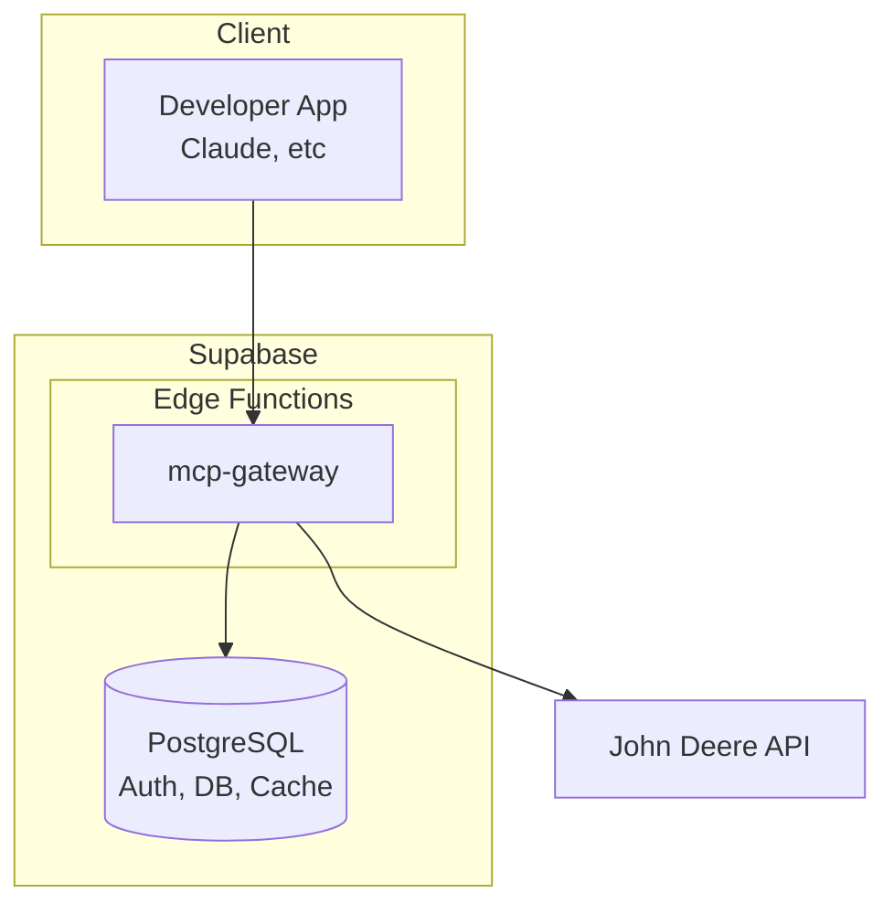

# FieldMCP

MCP infrastructure platform for agricultural APIs. Developers integrate once, access John Deere (and later Climate FieldView, CNHi) through unified MCP servers.

## Features

- **Unified API Access**: Single integration point for multiple agricultural data providers
- **OAuth Management**: Automatic token refresh and secure storage
- **Rate Limiting**: Tier-based limits with PostgreSQL caching
- **Developer Dashboard**: Next.js 16 app for API key management and farmer connections

## Architecture



## Tech Stack

- **Supabase Edge Functions**: MCP server (mcp-gateway) - Deno runtime
- **Supabase PostgreSQL**: Auth, DB, encrypted token storage, cache tables
- **Vercel**: Next.js 16 dashboard
- **Turborepo**: Monorepo orchestration
- **Biome**: Linting and formatting

## Installation

```bash
# Clone the repository
git clone https://github.com/ProductOfAmerica/field-mcp/actions
cd field-mcp

# Install dependencies
pnpm install

# Build all packages
pnpm build
```

## Usage

```bash
# Start development servers
pnpm dev

# Run linter
pnpm lint

# Type check
pnpm check
```

## Project Structure

```
fieldmcp/
├── apps/
│   └── dashboard/                    # Next.js developer dashboard
├── packages/
│   ├── types/                        # Shared TypeScript types (@fieldmcp/types)
│   └── supabase/
│       └── supabase/
│           ├── functions/
│           │   ├── _shared/          # Shared code for Edge Functions
│           │   └── mcp-gateway/      # Unified MCP server - auth, rate limits, provider calls
│           └── migrations/           # Database migrations
└── docs/
    └── plans/                        # Execution plans
```

## Environment Variables

### Supabase Edge Functions (packages/supabase/.env.local)

- `SUPABASE_URL` - Auto-set by Supabase
- `SUPABASE_SERVICE_ROLE_KEY` - Auto-set by Supabase
- `JOHN_DEERE_CLIENT_ID`
- `JOHN_DEERE_CLIENT_SECRET`
- `JOHN_DEERE_API_BASE`
- `INTERNAL_SECRET`

### apps/dashboard (.env.local)

- `NEXT_PUBLIC_SUPABASE_URL`
- `NEXT_PUBLIC_SUPABASE_ANON_KEY`
- `SUPABASE_SERVICE_KEY`
- `JOHN_DEERE_CLIENT_ID`
- `JOHN_DEERE_CLIENT_SECRET`
- `JOHN_DEERE_REDIRECT_URI`
- `STRIPE_SECRET_KEY`
- `STRIPE_WEBHOOK_SECRET`
- `NEXT_PUBLIC_GATEWAY_URL`
- `GATEWAY_INTERNAL_SECRET`

## Contributing

Pull requests are welcome. For major changes, please open an issue first to discuss what you would like to change.

1. Fork the repository
2. Create your feature branch (`git checkout -b feature/amazing-feature`)
3. Run `pnpm lint` and `pnpm check` before committing
4. Commit your changes
5. Push to the branch
6. Open a Pull Request

## License

ISC