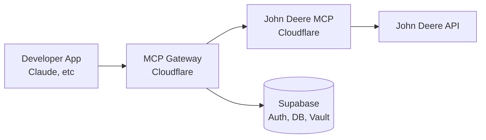

# AgriMCP

MCP infrastructure platform for agricultural APIs. Developers integrate once, access John Deere (and later Climate FieldView, CNHi) through unified MCP servers.

## Features

- **Unified API Access**: Single integration point for multiple agricultural data providers
- **OAuth Management**: Automatic token refresh and secure storage
- **Rate Limiting**: Tier-based limits with Cloudflare KV caching
- **Developer Dashboard**: Next.js 16 app for API key management and farmer connections

## Architecture



## Tech Stack

- **Cloudflare Workers**: MCP servers (mcp-gateway, mcp-john-deere)
- **Supabase**: Auth, PostgreSQL, encrypted token storage
- **Vercel**: Next.js 16 dashboard
- **Turborepo**: Monorepo orchestration
- **Biome**: Linting and formatting

## Installation

```bash
# Clone the repository
git clone https://github.com/your-org/agri-mcp.git
cd agri-mcp

# Install dependencies
pnpm install

# Build all packages
pnpm build
```

## Usage

```bash
# Start development servers
pnpm dev

# Run linter
pnpm lint

# Type check
pnpm check
```

## Project Structure

```
agrimcp/
├── apps/
│   └── dashboard/          # Next.js developer dashboard
├── packages/
│   ├── types/              # Shared TypeScript types (@agrimcp/types)
│   ├── mcp-gateway/        # API gateway worker - auth, rate limits, routing
│   ├── mcp-john-deere/     # John Deere MCP server - tools for JD API
│   └── supabase/           # Migrations and edge functions
└── docs/
    └── plans/              # Execution plans
```

## Environment Variables

### packages/mcp-gateway

- `SUPABASE_URL`
- `SUPABASE_SERVICE_KEY`

### packages/mcp-john-deere

- `SUPABASE_URL`
- `SUPABASE_SERVICE_KEY`
- `JOHN_DEERE_CLIENT_ID`
- `JOHN_DEERE_CLIENT_SECRET`

### apps/dashboard

- `NEXT_PUBLIC_SUPABASE_URL`
- `NEXT_PUBLIC_SUPABASE_ANON_KEY`
- `SUPABASE_SERVICE_KEY`
- `JOHN_DEERE_CLIENT_ID`
- `JOHN_DEERE_CLIENT_SECRET`
- `JOHN_DEERE_REDIRECT_URI`
- `STRIPE_SECRET_KEY`
- `STRIPE_WEBHOOK_SECRET`

## Contributing

Pull requests are welcome. For major changes, please open an issue first to discuss what you would like to change.

1. Fork the repository
2. Create your feature branch (`git checkout -b feature/amazing-feature`)
3. Run `pnpm lint` and `pnpm check` before committing
4. Commit your changes
5. Push to the branch
6. Open a Pull Request

## License

ISC